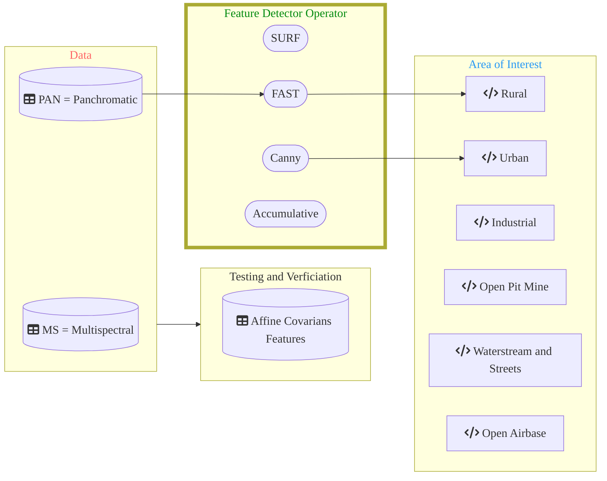

# Application and Verification - Feature Detection and Matching of the strongest 30 Features

DippoldEJ Satellite Datasets very-high Resolution medium Resolution Satellite Imagery Application AOI Features Detection and Matching  

 

Overview 
------------------------

Structure:  

  
 
Text 
------------------------

Text 
 
