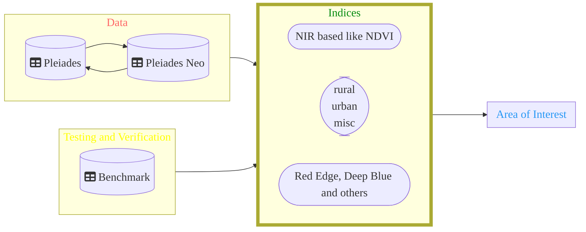

# Comparison - Area Features of Pleiades VS. Pleiades NEO

DippoldEJ Satellite Datasets Application Area Features  

 

Overview 
------------------------

Structure:  

  
 
Text 
------------------------

Text 
 
