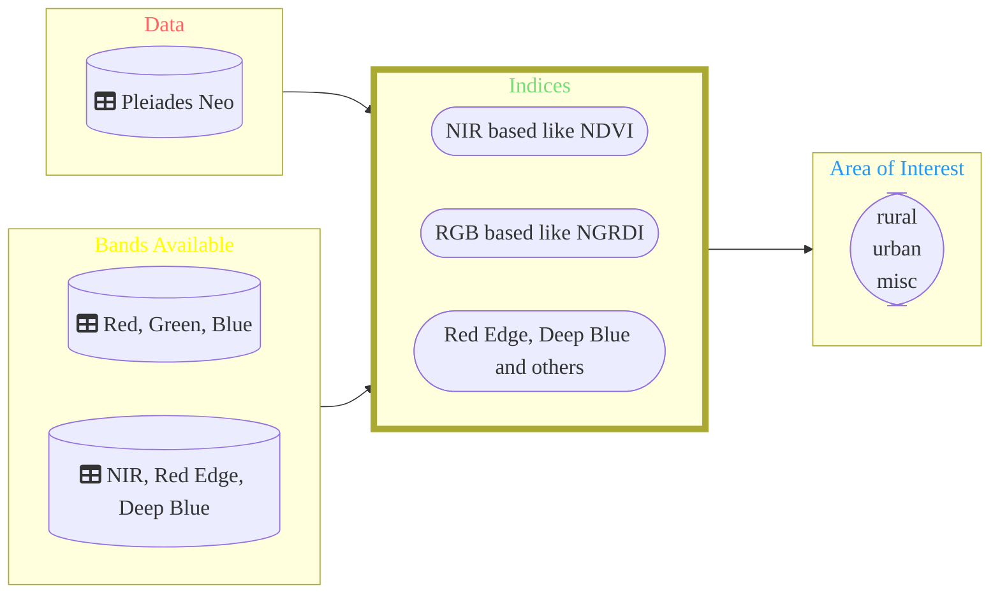

# Comparison - Area Features of Pleiades NEO

DippoldEJ Satellite Datasets Application Area Features VHR Satellite Imagery Pleiades NEO  

[SourcePleiades](https://github.com/DippoldEJ/Satellite-Datasets/tree/main/Pleiades-Neo)

Overview 
------------------------

Structure:  

  
 
The Indices 
------------------------

The comparision (Tran et al., 2022) and the review (Feng et al., 2022) puplished are used to demonstrate the power of area features and the differences between Pleiades and Pleiades NEO. 
 
 

|No |Acronym |long form |Bands |Formula | Range with Legend|
|---|--------|----------|------|--------|--------|
|01| NDVI| Normalized Differential Vegetation Index| Red, NIR| NDVI = $\frac{NIR - RED}{NIR + RED}$ | |

 

References 
------------------------

Feng, H., Tao, H., Li, Z., Yang, G., Zhao, C., 2022. Comparison of UAV RGB Imagery and Hyperspectral Remote-Sensing Data for Monitoring Winter Wheat Growth, Remote Sensing, p. 3811.

Tran, T.V., Reef, R., Zhu, X., 2022. A Review of Spectral Indices for Mangrove Remote Sensing, Remote Sensing, p. 4868.
 
 
