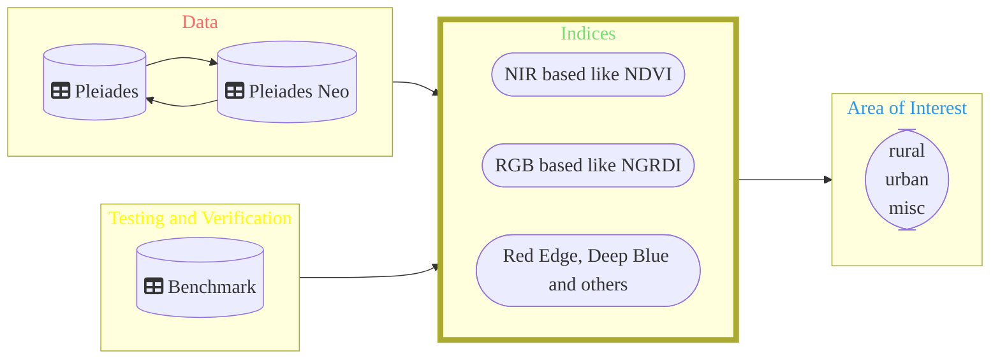

# Comparison - Area Features of Pleiades VS. Pleiades NEO

DippoldEJ Satellite Datasets Application Area Features  

Overview 
------------------------

Structure:  

  
 
The Indices 
------------------------

Text 
 
|No |Acronym |long form | Bands| Formula| 
|---|---|---|---|---|
|01| NDVI| Normalized Differential VEgetation Index| Red, NIR| NDVI = |

References 
------------------------

Hyperspectral Remote-Sensing Data for Monitoring Winter Wheat Growth, Remote Sensing, p. 3811.

Tran, T.V., Reef, R., Zhu, X., 2022. A Review of Spectral Indices for Mangrove Remote Sensing, Remote Sensing, p. 4868.

 
 
