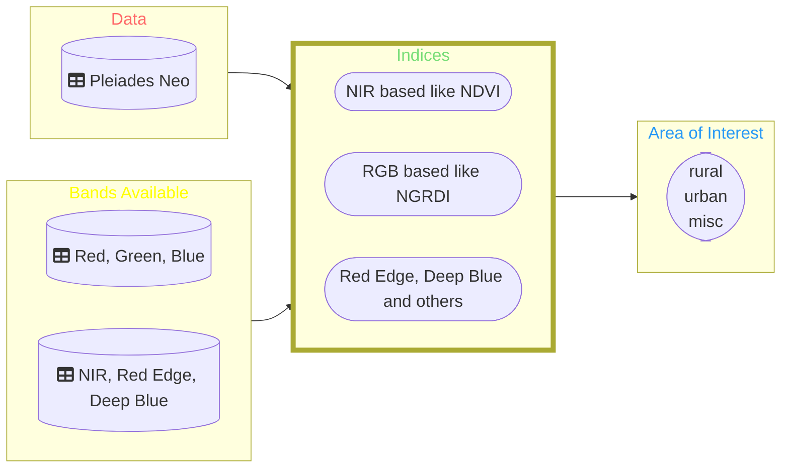

# Comparison - Area Features of Pleiades NEO

DippoldEJ Satellite Datasets Application Area Features VHR Satellite Imagery Pleiades NEO <br />

[SourcePleiades](https://github.com/DippoldEJ/Satellite-Datasets/tree/main/Pleiades-Neo)

Overview 
------------------------

Structure: <br />


```mermaid
flowchart LR;
%%{init: {
	'themeVariables': { 'fontSize': '20px', 'fontFamily': 'Didot'}
	}
}%%

 subgraph n[Data]
        direction LR
        b[(fa:fa-table Pleiades Neo)]
    end

 subgraph q[Bands Available]
        direction LR
        r[(fa:fa-table Red, Green, Blue)]
        h[(fa:fa-table NIR, Red Edge, Deep Blue)]
    end

 subgraph o[Indices]
        direction LR
        j([NIR based like NDVI])
        c([RGB based like NGRDI])
        m([Red Edge, Deep Blue and others])
    end

subgraph p[Area of Interest]
    a([rural <br /> urban  <br />  misc])
    end

style n color:#f66
style o stroke-width:6px
style o color:#77DD77

style p color:#2798F5
style q color:#FFFF00

n-->o
o-->p
q-->o


```
 <br />
 
The Indices  - Vegetation
------------------------

The comparision (Tran et al., 2022) and the review (Feng et al., 2022) puplished are used to demonstrate the power of area features with Pleiades NEO. <br />

```math 
EVI = G * \frac{NIR - RED}{NIR + C_1 * Red - C_2 * Blue + L}
```

Coefficients:<br />
 Gain Factor: 2.5<br />
 Atmospheric resistance coefficient 1: 6.0<br />
 Atmospheric resistance coefficient 2: 7.5<br />
 Canopy background adjustment: 1<br />


<br />

|No |Acronym |Formula| Long Form with Legend | Example|
|---|--------|----------|--------|--------|
|01| <p align="center">NDVI</p>| | <p align="center"> **Normalized Differential Vegetation Index** </p> | |
|02| <p align="center">NDRE</p> | | <p align="center"> **Normalized Difference Red Edge** </p>  | |
|03| <p align="center">EVI</p> | | <p align="center"> **Enhanced Vegetation Index** </p>| Example| 
|04| <p align="center">EVI 2</p> | |  <p align="center"> **Enhanced Vegetation Index 2** </p> | Example|
|05| <p align="center">CVI</p> | |  <p align="center"> **Chlorophyll Vegetation Index** </p> | Example|
|06| <p align="center">CI-RedEdge</p> | |   <p align="center"> **Chlorophyll Index Red Edge** </p> | Example|
<br />

References 
------------------------

Feng, H., Tao, H., Li, Z., Yang, G., Zhao, C., 2022. Comparison of UAV RGB Imagery and Hyperspectral Remote-Sensing Data for Monitoring Winter Wheat Growth, Remote Sensing, p. 3811.

Tran, T.V., Reef, R., Zhu, X., 2022. A Review of Spectral Indices for Mangrove Remote Sensing, Remote Sensing, p. 4868.
 
<br />
